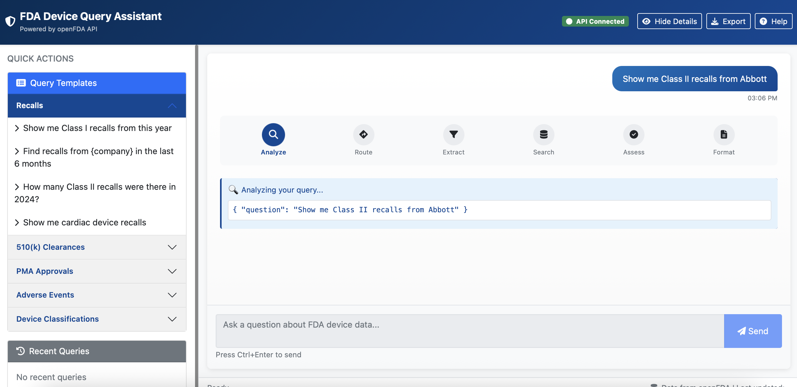
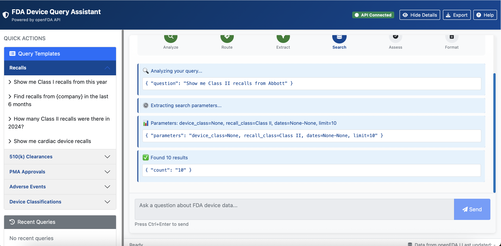

# OpenFDA Agent

An intelligent FDA device database query assistant that understands natural language and provides comprehensive safety analysis using the openFDA API.

## Agentic System Architecture

This system operates as an autonomous agent within the FDA's device data ecosystem, exhibiting genuine agency through perception, planning, action, and memory cycles:

- **Perception**: Natural language queries are analyzed and transformed into structured understanding through LLM-based intent classification and parameter extraction
- **Planning**: A LangGraph state-machine controller synthesizes execution plans, selecting optimal strategies and orchestrating multi-step workflows
- **Action**: Typed tool wrappers execute against FDA endpoints, handling pagination, retries, and cross-endpoint synthesis
- **Memory**: State persistence captures tool history, safety aggregates, and assessment feedback to inform subsequent decisions

Unlike static query systems, this agent continuously senses, decides, acts, and adapts—demonstrating true autonomy in navigating complex regulatory data requirements. The architecture combines deterministic parameter extraction with probabilistic reasoning, retrieval-augmented generation for documentation grounding, and comprehensive safety workups across multiple FDA endpoints.

## Features

- 🤖 **Natural Language Understanding**: Ask questions in plain English about FDA device data
- 🔄 **Intelligent Cross-Referencing**: Automatically handles complex queries that require data from multiple endpoints
- 🎯 **Smart Routing**: Automatically selects the right FDA database endpoint for your query
- 📊 **Comprehensive Safety Analysis**: Performs multi-endpoint safety checks for product codes
- 🌐 **Web Dashboard**: Interactive web interface for easy querying
- 📚 **RAG-Enhanced**: Uses retrieval-augmented generation for accurate field mapping
- 🔧 **Extensible Tools**: Modular design with separate tools for each FDA endpoint

## Dashboard Interface


*The dashboard provides an intuitive interface with quick action templates for common FDA queries*


*Real-time visualization of the agent's perception-routing-extraction-search workflow, showing LLM-orchestrated query analysis and parameter extraction*

## Quick Start

### Prerequisites

- Python 3.9+
- Virtual environment (recommended)
- Anthropic API key (required)
- OpenFDA API key (optional, for higher rate limits)

### Installation

1. Clone the repository:
```bash
git clone <repository-url>
cd openfda_agent
```

2. Create and activate virtual environment:
```bash
python -m venv .venv
source .venv/bin/activate  # On Windows: .venv\Scripts\activate
```

3. Install dependencies:
```bash
pip install -r requirements.txt
```

4. Set up environment variables:
```bash
cp .env.example .env
# Edit .env and add your API keys
```

### Usage

#### Web Dashboard

Start the dashboard:
```bash
python dashboard_control.py start
```

Access at: http://localhost:8000

Control commands:
```bash
python dashboard_control.py status   # Check if running
python dashboard_control.py stop     # Stop dashboard
python dashboard_control.py restart  # Restart dashboard
```

#### Command Line Interface

Query directly from terminal:
```bash
python -m agent.cli "What recalls exist for product code BZD?"
python -m agent.cli "Show me Class II devices from Abbott"
python -m agent.cli "How many PMA approvals in 2023?" --explain
```

#### Direct Tool Usage

Use specific tools directly:
```bash
# Search classifications
python -m tools.classification --product-code BZD --limit 5

# Search recalls
python -m tools.recall --firm-name Medtronic --limit 10

# Search 510(k) clearances
python -m tools.k510 --applicant "Boston Scientific" --limit 5
```

## Architecture

```
openfda_agent/
├── agent/          # LangGraph agent orchestration
│   ├── graph.py    # Main agent workflow with bounded retry budget
│   ├── router.py   # LLM-backed query analysis and planning
│   ├── extractor.py # Structured parameter extraction with validators
│   └── state.py    # AgentState for belief tracking
├── tools/          # Typed FDA API endpoint wrappers
│   ├── classification.py  # Device classifications and product codes
│   ├── recall.py          # Enforcement actions
│   ├── k510.py            # Premarket notifications
│   ├── pma.py             # Premarket approvals
│   ├── maude.py           # Adverse event reports
│   ├── udi.py             # Unique device identifiers
│   └── rl.py              # Registration & listing
├── dashboard/      # FastAPI web interface
│   └── app.py      # Session management and WebSocket streaming
├── rag/           # Hybrid retrieval system
│   ├── retrieval.py       # Documentation corpus management
│   └── hybrid.py          # BM25 + semantic similarity with RRF
└── tests/         # Comprehensive test suite
    ├── unit/              # VCR-recorded tool tests
    └── integration/       # End-to-end agent validation
```

### Control Flow Architecture

The system implements a four-node LangGraph state machine:

1. **Router Node**: Performs LLM-based query analysis, categorizes intent, and synthesizes execution plans
2. **Execute Tools Node**: Invokes typed tool wrappers with validated parameters
3. **Assessor Node**: Evaluates sufficiency using deterministic checks and safety short-circuits
4. **Answer Node**: Formats responses with comprehensive provenance metadata

The agent maintains `AgentState` throughout the episode, capturing:
- Query analysis and classification
- Tool call history and results
- Safety aggregates from multi-endpoint checks
- Assessor feedback for retry adjustments

## Key Capabilities

### 1. LLM-Orchestrated Query Planning
Every query undergoes structured analysis through Claude prompts that elicit:
- **Query Classification**: AGGREGATION, SEARCH, COUNT, or SAFETY_CHECK intent
- **Entity Extraction**: Product codes, K-numbers, dates with confidence scoring
- **Execution Strategy**: Selection between `exact`, `category`, or `broad` search approaches
- **Cross-Reference Detection**: Automatic identification when multiple endpoints are needed

### 2. Parameter Extraction and Validation
The `ParameterExtractor` leverages Claude's structured outputs with:
- **Regex Pre-extraction**: Captures deterministic patterns (K-numbers, product codes) before LLM invocation
- **Pydantic Validators**: Normalize device classes, enforce three-letter product codes, verify date formats
- **Confidence Heuristics**: Low-certainty fields trigger RAG assistance when scores fall below 0.8
- **Provenance Trail**: Emits human-readable filter strings for audit requirements

### 3. Cross-Endpoint Safety Synthesis
When safety intent is detected, the agent executes a three-pronged review:
- **Recall Analysis**: Enforcement records with enriched product code data via classification lookup
- **MAUDE Integration**: Adverse event narratives and patient impact descriptors
- **Classification Metadata**: Device class, regulation numbers, and panel information
- **Related Device Fallback**: Expands search to similar devices if direct matches are absent

### 4. Environment Adaptation
The agent accommodates openFDA constraints through:
- **Rate Limit Handling**: Differentiates 429 responses and adjusts retry strategy
- **Sparse Field Management**: Works around missing product codes in recalls
- **Temporal Awareness**: Handles future date requests gracefully with explanations
- **Pagination Control**: Safe bounded iteration with configurable limits

## Environment Modeling

The agent experiences the openFDA ecosystem as a partially observable environment:

### Observable State
- **Primary Channels**: JSON `results` containing domain records and `meta` with dataset-level signals
- **Temporal Dynamics**: Non-stationary environment with continual updates (new recalls, MAUDE reports)
- **Error Signals**: HTTP status codes, rate-limit headers, and empty result sets inform recovery strategies
- **Documentation Corpus**: 100+ scraped field guides and routing hints provide latent structural knowledge

### Action Space
Each tool encapsulates environment interaction with typed contracts:

| Tool | Endpoint | Key Capabilities | Provenance Data |
|------|----------|-----------------|-----------------|
| `classify` | `/device/classification` | Product code validation, device class lookup | `meta.last_updated`, regulation numbers |
| `k510_search` | `/device/510k` | Clearance history, applicant search | K-numbers, decision dates |
| `pma_search` | `/device/pma` | Approval chronology, supplements | PMA numbers, approval dates |
| `recall_search` | `/device/enforcement` | Safety actions, firm identification | Recall numbers, classification |
| `maude_search` | `/device/event` | Adverse events, patient outcomes | Event types, narrative text |
| `udi_search` | `/device/udi` | Device identifiers, packaging | DI records, brand names |
| `rl_search` | `/device/registrationlisting` | Establishment data, geography | FEI numbers, locations |

## Configuration

### Environment Variables

Required:
- `ANTHROPIC_API_KEY`: Claude API key for natural language processing

Optional:
- `OPENFDA_API_KEY`: FDA API key for higher rate limits (get one [here](https://open.fda.gov/apis/authentication/))

### Advanced Options

CLI flags:
- `--explain`: Show detailed routing and decision process
- `--dry-run`: Test routing without API calls
- `--output json`: Return JSON formatted results

## Hybrid Retrieval System

The RAG implementation fuses multiple retrieval strategies for optimal documentation grounding:

### Retrieval Architecture
- **BM25 Scoring**: Term frequency-based matching for exact field names and technical terms
- **Semantic Embeddings**: Dense vector similarity using sentence-transformers for conceptual matching
- **Reciprocal Rank Fusion**: Combines BM25 and embedding scores to maintain high recall while suppressing noise
- **Endpoint Filtering**: Concentrates search on relevant documentation slices based on detected endpoint

### Documentation Corpus
- Official openFDA field guides and endpoint documentation
- Internal glossaries for brand/firm aliases and common misspellings
- Routing cheatsheets mapping intents to endpoints
- Product code to generic name mappings

## Evaluation and Validation

### Automated Testing Strategy

```bash
make test          # Unit tests with VCR-recorded HTTP interactions
make integration   # End-to-end agent validation with live LLM calls
make smoke         # Quick functionality check with canonical queries
```

### Test Coverage
- **Unit Tests**: Verify tool primitives under recorded HTTP interactions
- **Integration Tests**: Exercise routing accuracy, extraction completeness, and assessor guardrails
- **Regression Suite**: Demonstrates structured extraction, Lucene generation, and provenance stamping

### Observed Metrics
- **Routing Accuracy**: >90% correct endpoint selection on labeled question set
- **Extraction Confidence**: Successfully signals low-confidence for ambiguous fields
- **Safety Synthesis**: Comprehensive multi-endpoint dossiers with fallback strategies
- **Provenance Completeness**: All responses include endpoint, query, timestamps, and record counts

### CLI Validation Modes
```bash
python -m agent.cli "your query" --dry-run   # Test routing without API calls
python -m agent.cli "your query" --explain   # Show detailed decision process
```

## Troubleshooting

### Common Issues

1. **Recursion Limit Error**: The agent retries up to 10 times. Check your query syntax.
2. **No Results Found**: Try broader search terms or check date ranges.
3. **API Rate Limits**: Add an OpenFDA API key for higher limits.

### Debug Mode

Run with explain flag for detailed execution trace:
```bash
python -m agent.cli "your query" --explain
```

## Technical Foundation

- **Orchestration**: [LangGraph](https://github.com/langchain-ai/langgraph) state-machine controller for deterministic workflow management
- **Language Model**: [Claude](https://www.anthropic.com/claude) for query analysis, planning, and parameter extraction
- **Data Source**: [OpenFDA API](https://open.fda.gov/) providing 7 device database endpoints
- **Retrieval**: [sentence-transformers](https://www.sbert.net/) for semantic embedding generation
- **Validation**: Pydantic models ensuring type safety and parameter validation across all tool contracts