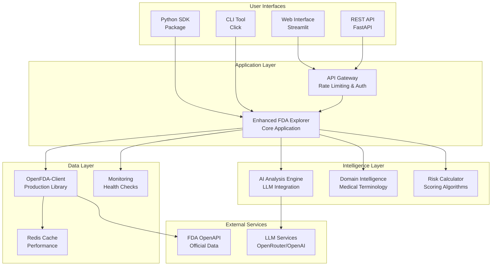

# Product Requirements Document: Enhanced FDA Data Explorer

**Version**: 1.0  
**Date**: July 6, 2025  
**Authors**: Product Development Team  
**Status**: Draft  

---

## 1. Executive Summary

### 1.1 Product Vision
Build a next-generation FDA medical device data exploration platform that combines the production-ready reliability of OpenFDA-Client with the intelligent analysis capabilities of FDA-Devices, creating a comprehensive solution for researchers, regulatory professionals, and healthcare organizations.

### 1.2 Problem Statement
Current FDA data exploration tools fall into two categories:
- **Basic API clients**: Reliable but require technical expertise and lack domain intelligence
- **Analysis applications**: User-friendly but limited scalability and reliability for production use

**Gap**: No solution combines production-grade reliability with intelligent FDA domain expertise and user-friendly interfaces.

### 1.3 Solution Overview
The Enhanced FDA Data Explorer will:
- Leverage OpenFDA-Client as a robust, production-ready data foundation
- Add AI-powered analysis and domain intelligence on top
- Provide multiple interfaces (web UI, API, SDK) for different user types
- Scale from individual researchers to enterprise deployments

### 1.4 Success Metrics
- **Adoption**: 1,000+ active users within 6 months
- **Reliability**: 99.9% uptime with comprehensive error handling
- **Performance**: <5 second response time for 90% of queries
- **User Satisfaction**: 4.5+ stars in user feedback
- **Data Coverage**: Support for all OpenFDA endpoints with 95%+ query success rate

---

## 2. Market Analysis

### 2.1 Target Market Segments

#### Primary Segments
1. **Regulatory Affairs Professionals** (High Value, High Volume)
   - Medical device companies conducting competitive intelligence
   - Regulatory consultants preparing submissions
   - Need: Fast, reliable access to regulatory precedents and safety data

2. **Healthcare Researchers** (Medium Value, High Volume)
   - Academic institutions studying device safety
   - Clinical researchers analyzing adverse events
   - Need: Comprehensive data analysis with statistical insights

3. **Healthcare Technology Companies** (High Value, Medium Volume)
   - Digital health platforms integrating FDA data
   - Medical device startups researching market landscape
   - Need: Programmatic access with enterprise-grade reliability

#### Secondary Segments
4. **Journalists and Policy Analysts** (Low Value, High Volume)
5. **Healthcare Investors** (Medium Value, Low Volume)
6. **Government Agencies** (High Value, Low Volume)

### 2.2 Competitive Analysis

| Competitor | Strengths | Weaknesses | Differentiation Opportunity |
|------------|-----------|------------|----------------------------|
| **OpenFDA Portal** | Official source, comprehensive | Limited analysis, technical barrier | Add AI insights and user-friendly interface |
| **Commercial FDA Tools** | Professional features | Expensive ($10K+/year), limited customization | Open-source foundation with enterprise features |
| **Academic Tools** | Domain expertise | Not production-ready, limited scope | Combine academic insights with production reliability |
| **Custom Solutions** | Tailored to specific needs | High development cost, maintenance burden | Provide customizable platform reducing build time |

### 2.3 Market Opportunity
- **Total Addressable Market**: $50M+ (FDA regulatory intelligence market)
- **Serviceable Addressable Market**: $15M (digital FDA data tools)
- **Serviceable Obtainable Market**: $2M (open-source + premium model)

---

## 3. Product Strategy

### 3.1 Product Philosophy
**"Production-grade reliability meets domain intelligence"**

Core principles:
- **Reliability First**: Every feature must meet production standards
- **Domain Intelligence**: Leverage medical device expertise in every interaction
- **User-Centric Design**: Optimize for user workflow, not technical architecture
- **Open Foundation**: Build on open-source with optional premium features

### 3.2 Product Positioning
**"The most reliable and intelligent way to explore FDA medical device data"**

- **vs. OpenFDA Portal**: More user-friendly with AI-powered insights
- **vs. Commercial Tools**: Open-source foundation with enterprise reliability
- **vs. Academic Tools**: Production-ready with comprehensive testing
- **vs. Custom Development**: Faster time-to-value with lower maintenance cost

### 3.3 Go-to-Market Strategy

#### Phase 1: Foundation (Months 1-3)
- Build core product with OpenFDA-Client integration
- Target early adopters in academic research
- Focus on reliability and basic AI features

#### Phase 2: Enhancement (Months 4-6)
- Add advanced AI analysis and domain intelligence
- Target regulatory affairs professionals
- Introduce premium features for enterprise users

#### Phase 3: Scale (Months 7-12)
- Expand to healthcare technology companies
- Add enterprise deployment options
- Build ecosystem of integrations and extensions

---

## 4. Product Requirements

### 4.1 Functional Requirements

#### 4.1.1 Core Data Access (Must Have)
**Requirement**: Reliable access to all FDA medical device databases
**Acceptance Criteria**:
- Support all OpenFDA device endpoints (events, classifications, clearances, PMA, enforcement, UDI)
- 99.9% query success rate with proper error handling
- Response time <2 seconds for simple queries, <10 seconds for complex analysis
- Handle rate limiting transparently with user feedback
- Support pagination for large result sets (1000+ records)

**Technical Implementation**:
```python
# Built on OpenFDA-Client foundation
class EnhancedFDAClient(OpenFDAClient):
    def __init__(self, config):
        super().__init__(api_key=config.api_key, **config.client_config)
        self.ai_analyzer = AIAnalysisEngine(config.ai_config)
        self.domain_intelligence = DomainIntelligence()
    
    async def intelligent_search(self, query: str, options: SearchOptions) -> EnhancedResults:
        # 1. Query enhancement using domain intelligence
        enhanced_query = self.domain_intelligence.enhance_query(query)
        
        # 2. Multi-source data retrieval using OpenFDA-Client
        raw_results = await self.multi_source_search(enhanced_query, options)
        
        # 3. AI-powered analysis and insights
        analysis = await self.ai_analyzer.analyze(raw_results, query)
        
        return EnhancedResults(raw_data=raw_results, analysis=analysis)
```

#### 4.1.2 AI-Powered Analysis (Must Have)
**Requirement**: Intelligent analysis of FDA data with domain expertise
**Acceptance Criteria**:
- Automatic query classification (device vs. manufacturer vs. indication)
- Medical terminology expansion and synonym handling
- Risk assessment scoring based on recall history and adverse events
- Timeline construction showing regulatory history
- Pattern recognition across manufacturers and device types
- Natural language insights generation

**Technical Implementation**:
```python
class AIAnalysisEngine:
    def __init__(self, config):
        self.llm_client = LLMClient(config)
        self.medical_ontology = MedicalOntology()
        self.risk_calculator = RiskCalculator()
    
    async def analyze(self, data: MultiSourceData, query: str) -> AnalysisResults:
        # Domain-specific analysis pipeline
        risk_score = self.risk_calculator.calculate_device_risk(data)
        timeline = self.build_regulatory_timeline(data)
        patterns = self.detect_safety_patterns(data)
        insights = await self.generate_insights(data, query, risk_score, timeline)
        
        return AnalysisResults(
            risk_score=risk_score,
            timeline=timeline,
            patterns=patterns,
            insights=insights
        )
```

#### 4.1.3 Multi-Interface Support (Must Have)
**Requirement**: Support different user interaction models
**Acceptance Criteria**:
- **Web Interface**: Streamlit-based UI for non-technical users
- **REST API**: For programmatic access and integrations
- **Python SDK**: For data scientists and researchers
- **CLI Tool**: For command-line workflows
- Consistent data models and responses across all interfaces

#### 4.1.4 Advanced Search Capabilities (Should Have)
**Requirement**: Sophisticated search and filtering options
**Acceptance Criteria**:
- Boolean search operators (AND, OR, NOT)
- Date range filtering with relative dates ("last 6 months")
- Fuzzy matching for device names and manufacturers
- Saved searches and alerts for new data
- Export capabilities (CSV, JSON, PDF reports)

#### 4.1.5 Data Visualization (Should Have)
**Requirement**: Rich visualizations for data exploration
**Acceptance Criteria**:
- Interactive charts using Plotly/Streamlit
- Timeline visualizations for regulatory history
- Risk heatmaps for device categories
- Trend analysis over time
- Comparative analysis between devices/manufacturers

#### 4.1.6 Enterprise Features (Could Have)
**Requirement**: Features for organizational deployment
**Acceptance Criteria**:
- User authentication and authorization
- Role-based access control
- Audit logging and compliance reporting
- White-label deployment options
- SSO integration (SAML, OAuth)

### 4.2 Non-Functional Requirements

#### 4.2.1 Performance Requirements
- **Response Time**: 90% of queries complete within 5 seconds
- **Throughput**: Support 100 concurrent users
- **Availability**: 99.9% uptime with graceful degradation
- **Scalability**: Horizontal scaling to support 10,000+ users

#### 4.2.2 Security Requirements
- **Input Validation**: Comprehensive protection against injection attacks
- **API Security**: Rate limiting, authentication, and authorization
- **Data Protection**: No storage of sensitive user data
- **Compliance**: GDPR compliance for international users

#### 4.2.3 Usability Requirements
- **Learning Curve**: New users productive within 15 minutes
- **Accessibility**: WCAG 2.1 Level AA compliance
- **Mobile Support**: Responsive design for tablet/mobile use
- **Internationalization**: Support for multiple languages

#### 4.2.4 Reliability Requirements
- **Error Handling**: Graceful handling of all FDA API errors
- **Retry Logic**: Automatic retry with exponential backoff
- **Fallback Modes**: Degraded functionality when services unavailable
- **Monitoring**: Comprehensive health checks and alerting

---

## 5. Technical Architecture

### 5.1 System Architecture



### 5.2 Technology Stack

#### Backend
- **Core Library**: OpenFDA-Client (production-ready foundation)
- **Web Framework**: FastAPI (for REST API) + Streamlit (for UI)
- **AI Integration**: OpenRouter API with fallback to OpenAI/Anthropic
- **Caching**: Redis for performance optimization
- **Database**: PostgreSQL for user data and analytics (optional)

#### Frontend
- **Primary UI**: Streamlit for rapid development and rich interactions
- **Visualizations**: Plotly for interactive charts
- **Styling**: Custom CSS for professional appearance

#### Infrastructure
- **Deployment**: Docker containers with Kubernetes orchestration
- **Monitoring**: Prometheus + Grafana for metrics
- **Logging**: Structured logging with ELK stack
- **CI/CD**: GitHub Actions for automated testing and deployment

### 5.3 Data Flow Architecture

```python
# High-level data flow
async def enhanced_search_flow(query: str, user_context: UserContext) -> SearchResults:
    # 1. Query Intelligence
    enhanced_query = await domain_intelligence.enhance_query(query)
    search_strategy = await query_classifier.classify(enhanced_query)
    
    # 2. Data Retrieval (using OpenFDA-Client)
    retrieval_tasks = [
        openfda_client.search(endpoint, enhanced_query.for_endpoint(endpoint))
        for endpoint in search_strategy.endpoints
    ]
    raw_results = await asyncio.gather(*retrieval_tasks)
    
    # 3. Data Processing
    normalized_data = data_processor.normalize(raw_results)
    cross_referenced_data = data_processor.cross_reference(normalized_data)
    
    # 4. AI Analysis
    analysis = await ai_engine.analyze(cross_referenced_data, enhanced_query)
    
    # 5. Results Assembly
    return SearchResults(
        data=cross_referenced_data,
        analysis=analysis,
        metadata=SearchMetadata(query=query, strategy=search_strategy)
    )
```

---

## 6. Implementation Plan

### 6.1 Development Phases

#### Phase 1: Foundation (Months 1-3) - MVP
**Goal**: Production-ready core with basic AI features

**Sprint 1 (Month 1): Core Integration**
- Integrate OpenFDA-Client as foundation library
- Build basic web interface with Streamlit
- Implement simple query enhancement
- Add comprehensive error handling and logging

**Sprint 2 (Month 2): AI Integration**
- Integrate LLM services for basic analysis
- Add query classification (device vs. manufacturer)
- Implement risk scoring algorithms
- Build timeline generation

**Sprint 3 (Month 3): Polish and Testing**
- Comprehensive testing suite
- Performance optimization
- Documentation and examples
- Beta user testing

**Deliverables**:
- ✅ Working web application
- ✅ Basic AI-powered analysis
- ✅ Production-ready error handling
- ✅ Comprehensive test coverage

#### Phase 2: Enhancement (Months 4-6) - Advanced Features
**Goal**: Advanced intelligence and enterprise readiness

**Sprint 4 (Month 4): Advanced Intelligence**
- Medical terminology expansion
- Cross-database correlation
- Pattern recognition algorithms
- Advanced visualization

**Sprint 5 (Month 5): Multi-Interface Support**
- REST API development
- Python SDK creation
- CLI tool implementation
- API documentation

**Sprint 6 (Month 6): Enterprise Features**
- User authentication system
- Role-based access control
- Advanced search capabilities
- Export and reporting features

**Deliverables**:
- ✅ Multiple user interfaces
- ✅ Advanced AI capabilities
- ✅ Enterprise security features
- ✅ Comprehensive API documentation

#### Phase 3: Scale (Months 7-12) - Production Deployment
**Goal**: Scalable, maintainable production system

**Sprint 7-8 (Months 7-8): Production Infrastructure**
- Kubernetes deployment
- Monitoring and alerting
- Performance optimization
- Security hardening

**Sprint 9-10 (Months 9-10): Advanced Features**
- Real-time data alerts
- Advanced analytics dashboard
- Integration marketplace
- White-label options

**Sprint 11-12 (Months 11-12): Ecosystem Building**
- Third-party integrations
- Plugin architecture
- Community features
- Long-term maintenance plan

### 6.2 Resource Requirements

#### Development Team
- **Technical Lead** (1 FTE): Architecture and technical decisions
- **Backend Developers** (2 FTE): Core application and AI integration
- **Frontend Developer** (1 FTE): UI/UX and visualization
- **DevOps Engineer** (0.5 FTE): Infrastructure and deployment
- **Product Manager** (0.5 FTE): Requirements and user feedback
- **QA Engineer** (0.5 FTE): Testing and quality assurance

#### Infrastructure Costs (Monthly)
- **Development Environment**: $500/month
- **Staging Environment**: $1,000/month
- **Production Environment**: $2,000/month (scales with usage)
- **AI Services**: $1,500/month (LLM API costs)
- **Monitoring and Tools**: $500/month

#### Total Budget Estimate
- **Development Cost**: $1.2M over 12 months
- **Infrastructure Cost**: $60K over 12 months
- **Total Investment**: $1.26M for first year

---

## 7. Risk Assessment and Mitigation

### 7.1 Technical Risks

#### High Risk: AI Service Dependency
**Risk**: Over-reliance on external LLM services
**Impact**: Service outages could disable AI features
**Mitigation**:
- Multiple LLM provider integration with automatic failover
- Local model deployment option for critical deployments
- Graceful degradation to non-AI features when services unavailable

#### Medium Risk: FDA API Changes
**Risk**: OpenFDA API changes breaking functionality
**Impact**: Potential data access disruption
**Mitigation**:
- OpenFDA-Client handles API versioning and changes
- Comprehensive API monitoring and alerting
- Automated testing against FDA API changes

#### Medium Risk: Performance Under Load
**Risk**: System performance degradation with increased usage
**Impact**: Poor user experience and potential downtime
**Mitigation**:
- Horizontal scaling architecture from day one
- Comprehensive performance testing
- Redis caching for frequently accessed data
- Rate limiting and resource management

### 7.2 Market Risks

#### Medium Risk: Limited Market Adoption
**Risk**: Target market may not adopt new solution
**Impact**: Lower than expected user growth
**Mitigation**:
- Early user research and validation
- Iterative development with user feedback
- Free tier to reduce adoption barriers
- Academic partnerships for initial user base

#### Low Risk: Competitive Response
**Risk**: Competitors may develop similar solutions
**Impact**: Market share erosion
**Mitigation**:
- Open-source foundation creates switching costs
- Focus on superior user experience
- Rapid feature development and innovation
- Strong community building

### 7.3 Operational Risks

#### Medium Risk: Security Vulnerabilities
**Risk**: Security issues could compromise user trust
**Impact**: Reputation damage and user loss
**Mitigation**:
- Security-first development practices
- Regular security audits and penetration testing
- Comprehensive input validation and sanitization
- Incident response plan and monitoring

#### Low Risk: Team Scaling Challenges
**Risk**: Difficulty hiring and retaining talent
**Impact**: Development delays and quality issues
**Mitigation**:
- Competitive compensation and equity
- Remote-first flexible work environment
- Clear career development paths
- Strong engineering culture and practices

---

## 8. Success Metrics and KPIs

### 8.1 Product Metrics

#### User Adoption
- **Monthly Active Users**: Target 1,000 within 6 months
- **User Retention**: 70% 30-day retention rate
- **Query Volume**: 10,000+ queries per month
- **Feature Adoption**: 80% of users try AI analysis features

#### Technical Performance
- **Uptime**: 99.9% availability
- **Response Time**: <5 seconds for 90% of queries
- **Error Rate**: <1% of all requests
- **API Success Rate**: >95% for all FDA endpoint queries

#### User Satisfaction
- **Net Promoter Score**: Target 50+
- **User Ratings**: 4.5+ stars average
- **Support Tickets**: <5% of users require support
- **Feature Requests**: Track and prioritize user feedback

### 8.2 Business Metrics

#### Revenue (if applicable)
- **Conversion Rate**: 10% from free to premium features
- **Customer Lifetime Value**: Track for enterprise users
- **Churn Rate**: <5% monthly for premium users

#### Market Impact
- **Market Share**: Capture 5% of addressable market
- **Brand Recognition**: 50% awareness in target segments
- **Community Growth**: 100+ active community contributors

### 8.3 Health Metrics

#### Development Velocity
- **Sprint Completion**: 90% of sprint goals met
- **Bug Resolution**: <24 hours for critical issues
- **Test Coverage**: >90% code coverage maintained
- **Documentation**: 100% of features documented

#### Infrastructure Health
- **Resource Utilization**: <80% average CPU/memory usage
- **Cost Efficiency**: Cost per user <$5/month
- **Security Incidents**: Zero critical security issues
- **Data Quality**: >99% data integrity maintained

---

## 9. User Experience Design

### 9.1 User Personas

#### Primary Persona: Sarah, Regulatory Affairs Manager
**Background**: 5+ years in medical device regulatory affairs
**Goals**: Quick access to FDA precedents and competitive intelligence
**Pain Points**: Current tools are either too expensive or too technical
**User Journey**:
1. Searches for device category (e.g., "cardiac stents")
2. Reviews AI-generated risk assessment and timeline
3. Explores detailed 510(k) clearances and adverse events
4. Exports summary report for internal presentation

#### Secondary Persona: Dr. Mike, Clinical Researcher
**Background**: Academic researcher studying device safety
**Goals**: Comprehensive data analysis for research publications
**Pain Points**: Need programming skills for current FDA data access
**User Journey**:
1. Searches for adverse events related to research topic
2. Uses advanced filtering and statistical analysis
3. Downloads detailed dataset for further analysis
4. Cites FDA data in academic publications

### 9.2 User Interface Design Principles

#### Simplicity First
- **Progressive Disclosure**: Show simple interface by default, advanced features on demand
- **Smart Defaults**: Pre-configure common use cases
- **Contextual Help**: Inline guidance without cluttering interface

#### Domain Intelligence
- **Medical Terminology**: Auto-suggest medical device terms
- **Regulatory Context**: Explain FDA processes and terminology
- **Smart Categorization**: Automatically organize results by relevance

#### Transparency and Trust
- **Data Provenance**: Always show data source and freshness
- **AI Confidence**: Indicate confidence levels for AI-generated insights
- **Methodology**: Explain how risk scores and insights are calculated

### 9.3 Interface Specifications

#### Web Interface Layout
```
┌─────────────────────────────────────────────────────┐
│ Enhanced FDA Data Explorer                    [⚙️ Settings] │
├─────────────────────────────────────────────────────┤
│ 🔍 Search: [insulin pump                    ] [🔎] │
│    💡 AI Suggestions: "insulin infusion pump", "CSII" │
├─────────────────────────────────────────────────────┤
│ 📊 AI Analysis Summary                              │
│ ┌─ Risk Score: 🟨 Medium (65/100)                   │
│ ├─ Key Findings: 12 recalls in last 5 years        │
│ └─ Trend: ↗️ Increasing adverse events              │
├─────────────────────────────────────────────────────┤
│ 📈 Regulatory Timeline    🗂️ Data Sources           │
│ 📋 Adverse Events         🔍 Related Devices        │
│ 🚨 Recalls & Enforcement  📊 Market Analysis        │
└─────────────────────────────────────────────────────┘
```

#### API Interface Example
```python
# Python SDK usage
from enhanced_fda_explorer import FDAExplorer

explorer = FDAExplorer(api_key="your-key")

# Simple search with AI analysis
results = await explorer.search(
    query="insulin pump",
    include_analysis=True,
    max_results=1000
)

print(f"Risk Score: {results.analysis.risk_score}")
print(f"Key Insights: {results.analysis.insights}")

# Advanced search with filters
results = await explorer.advanced_search(
    device_name="insulin pump",
    date_range="2020-2024",
    severity=["Class I", "Class II"],
    include_patterns=True
)
```

---

## 10. Go-to-Market Strategy

### 10.1 Launch Strategy

#### Soft Launch (Month 3)
- **Target**: 50 beta users from academic partnerships
- **Focus**: Core functionality validation and bug fixes
- **Success Criteria**: 80% user satisfaction, <5% critical bugs

#### Public Launch (Month 6)
- **Target**: 500 users across all segments
- **Focus**: Feature completeness and performance optimization
- **Success Criteria**: 1000+ queries/week, 70% user retention

#### Scale Launch (Month 9)
- **Target**: 2000+ users with enterprise adoptions
- **Focus**: Advanced features and enterprise support
- **Success Criteria**: 10+ enterprise customers, profitable unit economics

### 10.2 User Acquisition Channels

#### Primary Channels
1. **Academic Partnerships** (Lowest cost, highest quality)
   - University research departments
   - Medical device conferences
   - Academic publications and citations

2. **Professional Networks** (Medium cost, high quality)
   - Regulatory affairs associations
   - LinkedIn targeted campaigns
   - Industry webinars and presentations

3. **Content Marketing** (Medium cost, scalable)
   - FDA data analysis blog posts
   - YouTube tutorials and demos
   - Open-source community contributions

#### Secondary Channels
4. **Search Engine Marketing** (High cost, scalable)
5. **Industry Publications** (High cost, targeted reach)
6. **Partner Integrations** (Low cost, long-term)

### 10.3 Pricing Strategy

#### Freemium Model
**Free Tier** (Community Edition):
- Up to 100 queries per month
- Basic AI analysis
- Standard data export
- Community support

**Professional Tier** ($49/month):
- Unlimited queries
- Advanced AI analysis
- Priority support
- Custom export formats

**Enterprise Tier** ($299/month):
- White-label deployment
- SSO integration
- Dedicated support
- Custom integrations

#### Value Proposition
- **vs. Building Custom**: 90% faster time-to-value
- **vs. Commercial Tools**: 70% cost reduction
- **vs. Manual FDA Portal**: 10x faster insights generation

---

## 11. Technical Implementation Details

### 11.1 Core Architecture Components

#### Enhanced FDA Client
```python
class EnhancedFDAExplorer:
    """
    Main application class combining OpenFDA-Client reliability
    with intelligent analysis capabilities.
    """
    
    def __init__(self, config: ExplorerConfig):
        # Foundation: Production-ready OpenFDA client
        self.openfda_client = OpenFDAClient(
            api_key=config.fda_api_key,
            **config.client_config
        )
        
        # Intelligence layer
        self.ai_engine = AIAnalysisEngine(config.ai_config)
        self.domain_intelligence = MedicalDeviceDomainIntelligence()
        self.query_enhancer = QueryEnhancer()
        
        # Performance and reliability
        self.cache = RedisCache(config.cache_config)
        self.rate_limiter = RateLimiter(config.rate_limit_config)
        self.monitor = HealthMonitor()
    
    async def intelligent_search(self, query: str, options: SearchOptions) -> EnhancedResults:
        """Main search method with comprehensive intelligence."""
        
        # 1. Query enhancement and classification
        enhanced_query = await self.query_enhancer.enhance(query, options)
        search_strategy = await self.domain_intelligence.plan_search(enhanced_query)
        
        # 2. Multi-source data retrieval with error handling
        try:
            raw_results = await self._execute_search_strategy(search_strategy)
        except Exception as e:
            # Graceful degradation with partial results
            raw_results = await self._fallback_search(enhanced_query)
            self.monitor.log_error("search_execution", e)
        
        # 3. Data processing and correlation
        processed_data = await self._process_and_correlate(raw_results)
        
        # 4. AI-powered analysis
        analysis = await self.ai_engine.analyze(processed_data, enhanced_query)
        
        # 5. Results assembly with metadata
        return EnhancedResults(
            query=enhanced_query,
            data=processed_data,
            analysis=analysis,
            metadata=self._build_metadata(search_strategy, raw_results)
        )
```

#### AI Analysis Engine
```python
class AIAnalysisEngine:
    """
    AI-powered analysis engine for FDA data insights.
    Combines multiple analysis techniques for comprehensive intelligence.
    """
    
    def __init__(self, config: AIConfig):
        self.llm_client = MultiProviderLLMClient(config.providers)
        self.risk_calculator = DeviceRiskCalculator()
        self.timeline_builder = RegulatoryTimelineBuilder()
        self.pattern_detector = SafetyPatternDetector()
        
    async def analyze(self, data: ProcessedFDAData, query: EnhancedQuery) -> AnalysisResults:
        """Comprehensive analysis pipeline."""
        
        # Parallel analysis tasks
        analysis_tasks = await asyncio.gather(
            self._calculate_risk_score(data),
            self._build_regulatory_timeline(data),
            self._detect_safety_patterns(data),
            self._generate_insights(data, query),
            return_exceptions=True
        )
        
        # Handle any analysis failures gracefully
        risk_score, timeline, patterns, insights = self._handle_analysis_results(analysis_tasks)
        
        return AnalysisResults(
            risk_assessment=risk_score,
            regulatory_timeline=timeline,
            safety_patterns=patterns,
            ai_insights=insights,
            confidence_scores=self._calculate_confidence(analysis_tasks)
        )
    
    async def _generate_insights(self, data: ProcessedFDAData, query: EnhancedQuery) -> AIInsights:
        """Generate natural language insights using LLM."""
        
        # Prepare data summary for LLM
        data_summary = self._prepare_data_summary(data)
        
        # Context-aware prompt generation
        prompt = self._build_analysis_prompt(data_summary, query)
        
        # Multi-model analysis with fallback
        try:
            insights = await self.llm_client.generate_insights(prompt)
            return self._validate_insights(insights)
        except Exception as e:
            # Fallback to rule-based insights
            return self._generate_fallback_insights(data, query)
```

#### Domain Intelligence Module
```python
class MedicalDeviceDomainIntelligence:
    """
    Medical device domain expertise for intelligent query processing.
    """
    
    def __init__(self):
        self.medical_ontology = self._load_medical_ontology()
        self.device_taxonomy = self._load_device_taxonomy()
        self.manufacturer_index = self._load_manufacturer_index()
        self.synonym_engine = MedicalSynonymEngine()
    
    async def enhance_query(self, query: str) -> EnhancedQuery:
        """Enhance user query with domain intelligence."""
        
        # 1. Query classification
        query_type = await self._classify_query(query)
        
        # 2. Medical terminology expansion
        expanded_terms = await self.synonym_engine.expand(query)
        
        # 3. Device category inference
        device_categories = await self._infer_device_categories(query)
        
        # 4. Manufacturer normalization
        normalized_manufacturers = await self._normalize_manufacturers(query)
        
        return EnhancedQuery(
            original=query,
            type=query_type,
            expanded_terms=expanded_terms,
            device_categories=device_categories,
            manufacturers=normalized_manufacturers,
            search_strategy=self._determine_search_strategy(query_type)
        )
    
    async def _classify_query(self, query: str) -> QueryType:
        """Classify query as device, manufacturer, or indication."""
        
        # Rule-based classification
        if query.lower() in self.manufacturer_index:
            return QueryType.MANUFACTURER
        
        if query.lower() in self.device_taxonomy:
            return QueryType.DEVICE
        
        # LLM-based classification for ambiguous cases
        classification_prompt = f"""
        Classify this FDA medical device query: "{query}"
        
        Options:
        - DEVICE: Searching for a specific medical device or device type
        - MANUFACTURER: Searching for a company or manufacturer
        - INDICATION: Searching for devices used for a medical condition
        - MIXED: Query contains multiple types
        
        Response format: {{type: "DEVICE|MANUFACTURER|INDICATION|MIXED", confidence: 0.0-1.0}}
        """
        
        result = await self.llm_client.classify(classification_prompt)
        return QueryType(result['type'])
```

### 11.2 Data Processing Pipeline

#### Multi-Source Data Correlation
```python
class DataCorrelationEngine:
    """
    Correlates data across multiple FDA databases to build comprehensive device profiles.
    """
    
    async def correlate_device_data(self, raw_results: Dict[str, List[Dict]]) -> CorrelatedDeviceData:
        """Build comprehensive device profile from multi-source data."""
        
        # 1. Entity resolution - match devices across databases
        device_entities = await self._resolve_device_entities(raw_results)
        
        # 2. Build device profiles
        device_profiles = {}
        for device_id, entities in device_entities.items():
            profile = await self._build_device_profile(entities)
            device_profiles[device_id] = profile
        
        # 3. Cross-reference analysis
        cross_references = await self._analyze_cross_references(device_profiles)
        
        return CorrelatedDeviceData(
            profiles=device_profiles,
            cross_references=cross_references,
            entity_mappings=device_entities
        )
    
    async def _build_device_profile(self, entities: List[DeviceEntity]) -> DeviceProfile:
        """Build comprehensive profile for a single device."""
        
        profile = DeviceProfile()
        
        # Aggregate data from different sources
        for entity in entities:
            if entity.source == "510k":
                profile.clearances.append(entity.data)
            elif entity.source == "pma":
                profile.approvals.append(entity.data)
            elif entity.source == "events":
                profile.adverse_events.append(entity.data)
            elif entity.source == "recalls":
                profile.recalls.append(entity.data)
        
        # Calculate aggregate metrics
        profile.risk_indicators = self._calculate_risk_indicators(profile)
        profile.regulatory_summary = self._summarize_regulatory_history(profile)
        
        return profile
```

### 11.3 Performance Optimization

#### Caching Strategy
```python
class IntelligentCacheManager:
    """
    Multi-layer caching for optimal performance.
    """
    
    def __init__(self, config: CacheConfig):
        self.redis_client = Redis(config.redis_url)
        self.memory_cache = TTLCache(maxsize=1000, ttl=300)  # 5-minute memory cache
        self.results_cache_ttl = config.results_ttl  # 1 hour default
        
    async def get_or_compute(self, cache_key: str, compute_func: Callable, ttl: int = None) -> Any:
        """Get from cache or compute with intelligent caching strategy."""
        
        # 1. Check memory cache (fastest)
        if cache_key in self.memory_cache:
            return self.memory_cache[cache_key]
        
        # 2. Check Redis cache
        cached_result = await self.redis_client.get(cache_key)
        if cached_result:
            result = pickle.loads(cached_result)
            self.memory_cache[cache_key] = result  # Populate memory cache
            return result
        
        # 3. Compute result
        result = await compute_func()
        
        # 4. Cache at multiple levels
        cache_ttl = ttl or self.results_cache_ttl
        await self.redis_client.setex(cache_key, cache_ttl, pickle.dumps(result))
        self.memory_cache[cache_key] = result
        
        return result
    
    def build_cache_key(self, query: EnhancedQuery, options: SearchOptions) -> str:
        """Build deterministic cache key from query and options."""
        key_components = [
            query.normalized_text,
            query.type.value,
            json.dumps(options.dict(), sort_keys=True)
        ]
        return hashlib.md5("|".join(key_components).encode()).hexdigest()
```

### 11.4 Error Handling and Reliability

#### Comprehensive Error Handling
```python
class ReliabilityManager:
    """
    Comprehensive error handling and reliability management.
    """
    
    def __init__(self, config: ReliabilityConfig):
        self.circuit_breaker = CircuitBreaker(config.circuit_breaker)
        self.retry_policy = RetryPolicy(config.retry)
        self.health_monitor = HealthMonitor()
        
    async def execute_with_reliability(self, operation: Callable, context: str) -> Any:
        """Execute operation with comprehensive reliability patterns."""
        
        # Circuit breaker pattern
        if self.circuit_breaker.is_open(context):
            raise ServiceUnavailableError(f"Circuit breaker open for {context}")
        
        # Retry with exponential backoff
        last_exception = None
        for attempt in range(self.retry_policy.max_attempts):
            try:
                result = await operation()
                self.circuit_breaker.record_success(context)
                return result
                
            except RetryableError as e:
                last_exception = e
                if attempt < self.retry_policy.max_attempts - 1:
                    wait_time = self.retry_policy.calculate_wait_time(attempt)
                    await asyncio.sleep(wait_time)
                    continue
                
            except NonRetryableError as e:
                self.circuit_breaker.record_failure(context)
                raise e
        
        # All retries exhausted
        self.circuit_breaker.record_failure(context)
        raise MaxRetriesExceededError(f"Max retries exceeded for {context}") from last_exception
```

---

## 12. Conclusion

This Product Requirements Document outlines a comprehensive approach to building an Enhanced FDA Data Explorer that combines the best aspects of both existing solutions:

### 12.1 Key Innovation
- **Production-grade foundation** using OpenFDA-Client for reliability
- **Intelligent analysis layer** with AI-powered insights and domain expertise
- **Multi-interface support** serving different user types and use cases
- **Scalable architecture** ready for enterprise deployment

### 12.2 Competitive Advantage
- **Open-source foundation** with enterprise features reduces vendor lock-in
- **Domain intelligence** provides superior insights compared to generic tools
- **Production reliability** ensures consistent performance for critical use cases
- **Comprehensive coverage** serves entire FDA data ecosystem

### 12.3 Success Factors
- **User-centric design** based on real workflow needs
- **Iterative development** with continuous user feedback
- **Strong technical foundation** ensuring scalability and reliability
- **Clear go-to-market strategy** targeting high-value user segments

### 12.4 Next Steps
1. **Validate assumptions** through user research and market analysis
2. **Assemble development team** with required expertise
3. **Build MVP** focusing on core value proposition
4. **Iterate based on feedback** to achieve product-market fit

This PRD provides a roadmap for building a market-leading FDA data exploration platform that advances the state of the art in regulatory intelligence tools.

---

**Document Version**: 1.0  
**Last Updated**: July 6, 2025  
**Next Review**: August 6, 2025  
**Stakeholder Approval**: [Pending]